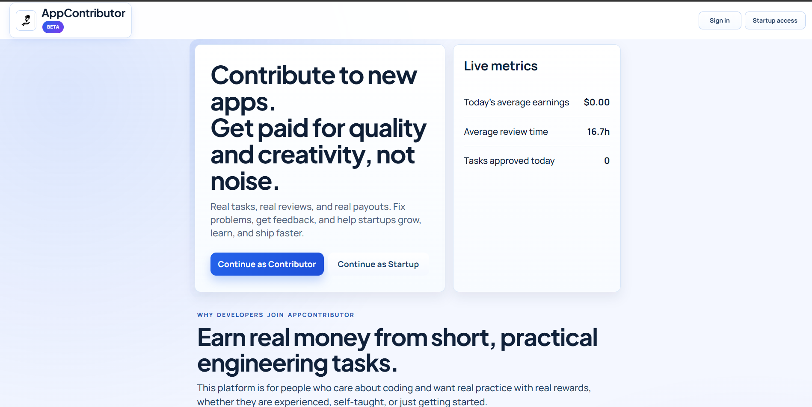
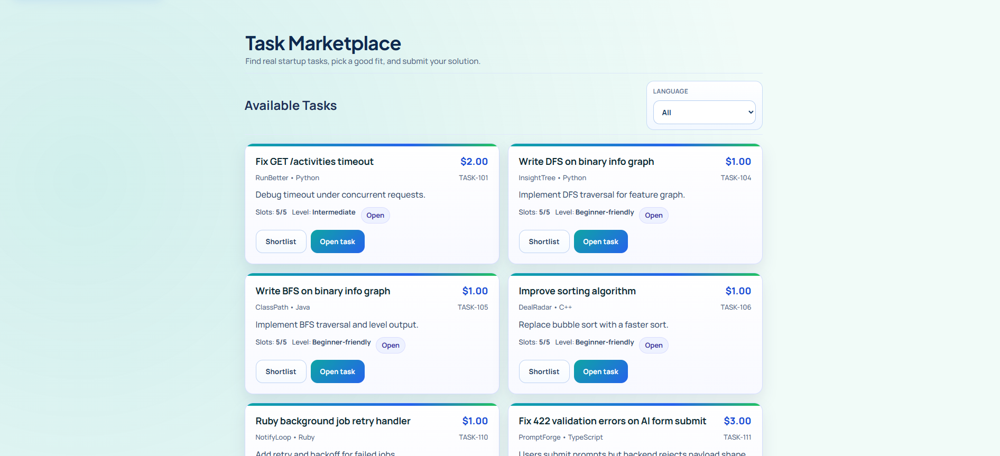
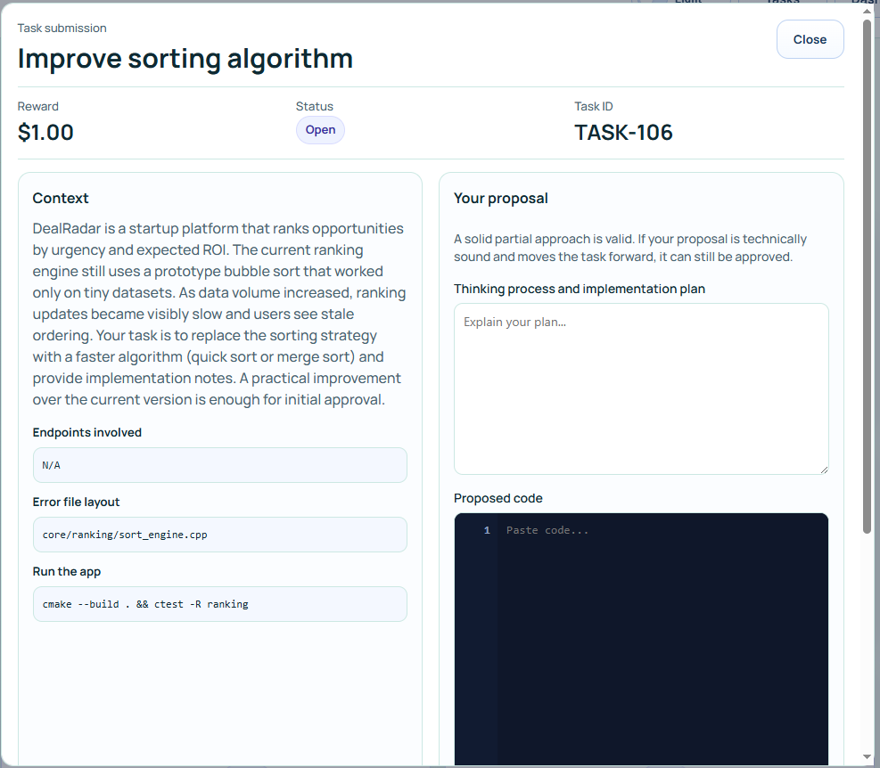

# AppContributor

> A task-based platform where startups post real coding blockers, errors and developers submit practical fixes for rewards.


## Why this exists

Most micro-task platforms pay for clicks and surveys.  
AppContributor pays for **actual debugging and implementation work** that helps startups ship.

### Two-sided model

- **Startups**: post scoped technical blockers and reward useful outcomes.
- **Contributors**: solve real tickets, build experience, and get paid.

---

## Core workflow

1. 🏢 Startup submits a task request.
2. 🛡️ Admin reviews and publishes safe tasks.
3. 👩‍💻 Contributors submit thinking + code (+ optional attachments).
4. ✅ Admin marks approved / partial / rejected.
5. 🧠 Startup rates solution usefulness.
6. 💸 Payout flow handles accepted outcomes.

---

## Features (current)

- 🔐 Auth + role-based access (`contributor`, `startup`, `admin`)
- 📋 Task marketplace with rewards and slot limits -> Mostly, 5 possible contributors per task
- 🧩 Submission of a task functionality with review states
- 📎 Optional submission attachments (`.py`, `.pdf`, `.txt`, `.md`, `.zip`, `.png`, `.jpg`)
- 🧾 Wallet, payout requests, and receipts
- 📉 Admin analytics + user activity overview
- 🚨 Disputes and startup feedback scoring
- 🧪 Staging-safe and sandbox-friendly task patterns

---

## Screenshots

### Landing


### Tasks marketplace


### Task submission


---

## Tech stack

- **Backend**: Python, FastAPI, SQLAlchemy, Alembic
- **Frontend**: Vanilla JavaScript, HTML, CSS
- **Payments**: Stripe + PayPal webhook scaffolding
- **Telemetry**: PostHog + optional Sentry

---

## Project structure

```text
backend/
  api_server.py
  alembic/
  scripts/
frontend/
  index.html
  tasks.html
  dashboard.html
  app.js
  tasks.js
  dashboard.js
```

---

## Run locally

### 1) Backend

```bash
cd backend
python -m venv .venv
.venv\Scripts\activate
pip install -r requirements.txt
python -m alembic -c alembic.ini upgrade head
python -m uvicorn api_server:app --host 127.0.0.1 --port 8000
```

### 2) Frontend

```bash
cd frontend
python -m http.server 5500
```

Open: `http://127.0.0.1:5500`

---

## Environment

Use `backend/.env.example` as baseline.

Important keys:

- `DATABASE_URL` (optional; defaults to local SQLite)
- `CORS_ALLOW_ORIGINS`
- `STRIPE_SECRET_KEY`
- `STRIPE_PUBLISHABLE_KEY`
- `STRIPE_WEBHOOK_SECRET`
- `PAYPAL_WEBHOOK_TOKEN`

---

## Product direction

Current trust-first positioning:

- Prefer **sandbox/staging/internal** tasks early
- Avoid direct production-risk changes in open tasks
- Keep scope explicit to prevent unpaid cleanup

---

## Docs

- `ROADMAP.md` — ongoing implementation priorities
- `MONETIZATION_PLAN.md` — platform revenue model and KPI logic
- `FEEDBACK_RECORD.md` — community feedback intake and triage
- `BETA_RELEASE_RUNBOOK.md` — release/deploy safety checklist

---

## Contributing

PRs and ideas are welcome.  
If you're contributing code, prioritize:

- narrow task scope
- explicit acceptance criteria
- security and rollback safety

---

## License

MIT
